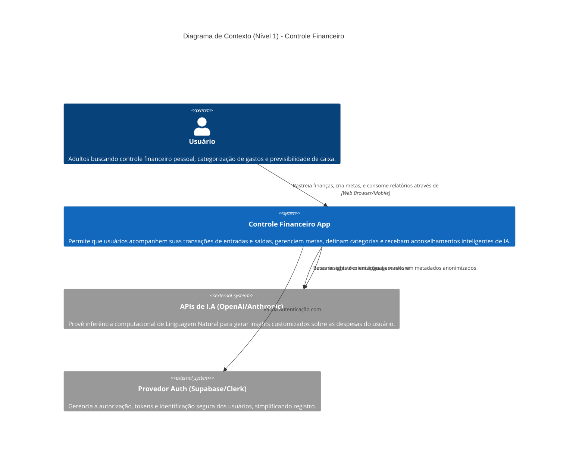
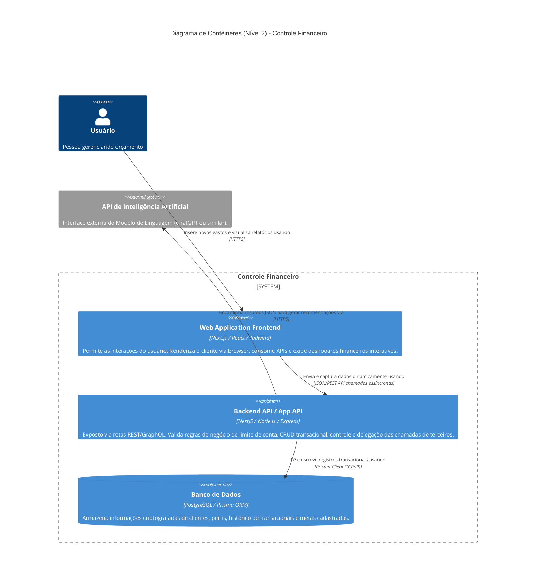
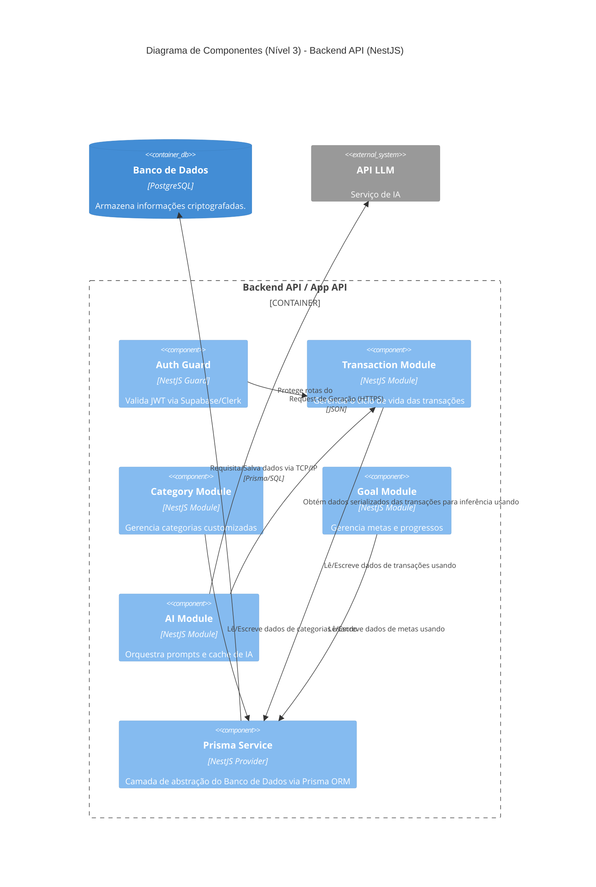
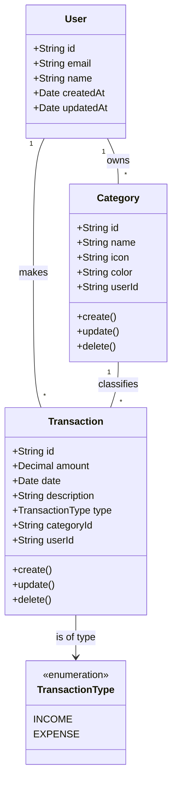
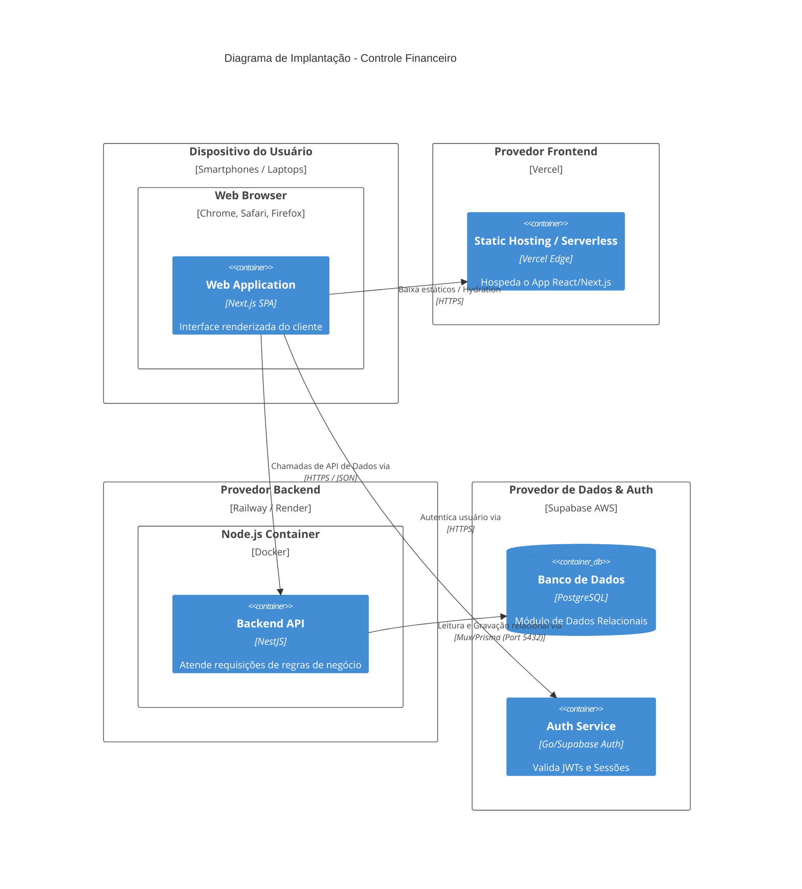

# Modelos C4 de Arquitetura

Este documento mapeia a arquitetura técnica de software do projeto Controle Financeiro utilizando a visão padrão do framework C4 Model (Context e Container).

---

## 1. Nível 1: Diagrama de Contexto (System Context)

O diagrama de contexto mostra como o sistema Controle de Finanças se relaciona com seus usuários e provedores periféricos externos.

---

## 2. Nível 2: Diagrama de Contêineres (Containers)

No escopo de Contêineres, o "App Controle Financeiro" é desmembrado em suas partes acionáveis (Frontend, Backend, DB).

---

### Breves Requisitos Arquitetônicos Atendidos
- **Escalabilidade (RNF):** Solução Backend e Frontend destacadas. O Backend concentra a regra de negócio rigorosa em NestJS enquanto o WebApp (NextJS) possui cache ágil focado em renderização de UI.
- **Segurança (RNF):** Interações de delegação de acesso por SSO.
- **Agilidade de Consultas:** Armazenamento Transacional rígido SQL (Postgres). Promove integridade referencial nas finanças (sem transação órfã).

---

## 3. Nível 3: Diagrama de Componentes (Components)

Foca na arquitetura interna do Container "Backend API / App API" construído com NestJS.

---

## 4. Nível 4: Diagrama de Classes / Código (Code)

Foco interno de uma das entidades principais. Exemplificado com o diagrama de classes da entidade "Transaction" e sua relação com "Category" e "User".

---

## 5. Diagrama de Implantação (Deployment)

Mapeia a topologia e implantação da aplicação nos provedores de nuvem (Vercel, Render/Railway, Supabase).

