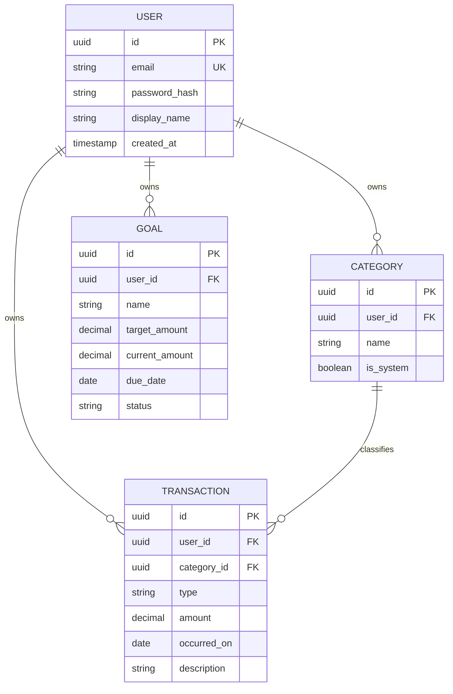

# Modelo de dados (conceitual → lógico)

## Entidades

### User

- `id` (PK, UUID)
- `email` (unique, not null)
- `password_hash` (not null)
- `display_name` (nullable)
- `created_at`, `updated_at`

### Category

- `id` (PK)
- `user_id` (FK → User, not null)
- `name` (not null)
- `is_system` (boolean, default false) — categorias seed por usuário ou globais conforme implementação
- `created_at`, `updated_at`

**Regra:** unicidade `(user_id, name)` recomendada.

### Transaction (lançamento)

- `id` (PK)
- `user_id` (FK, not null)
- `category_id` (FK, not null)
- `type` (enum: `income` | `expense`)
- `amount` (decimal, >= 0)
- `occurred_on` (date, not null)
- `description` (text, nullable)
- `created_at`, `updated_at`

### Goal (meta)

- `id` (PK)
- `user_id` (FK, not null)
- `name` (not null)
- `target_amount` (decimal, > 0)
- `current_amount` (decimal, >= 0) — v1 manual
- `due_date` (date, nullable)
- `status` (enum: `active` | `completed` | `archived`)
- `created_at`, `updated_at`

## Relacionamentos

```
User 1 —— * Category
User 1 —— * Transaction
User 1 —— * Goal
Category 1 —— * Transaction
```

## Visões / agregações (não persistidas)

- **Resumo mensal:** `SUM` por `type` e por `category_id` filtrando `user_id` e intervalo de datas.
- **Saldo:** receitas − despesas no período.

## Diagrama (Mermaid)



## Migrações

- Ordem sugerida: User → Category → Transaction → Goal.
- Índices: `(user_id, occurred_on)` em Transaction; `(user_id, status)` em Goal.
